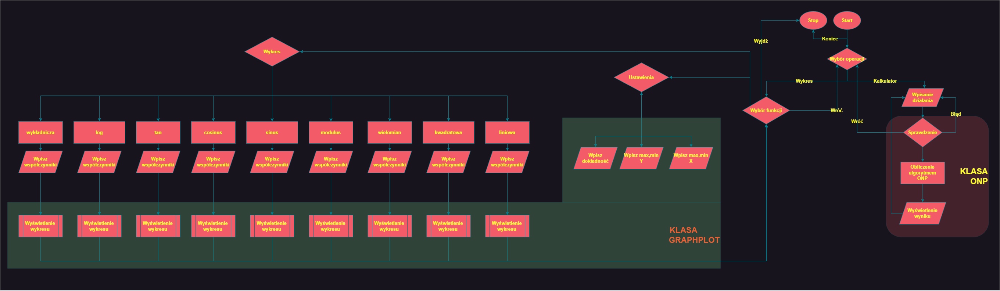

## Kalkulator ONP z plotterem

Prosty kalkulator graficzny wykorzystujący Odwróconą Notację Polską.

<h3>#Do uruchomienia wymagany jest zaintstalowany <b>Python39</b>!  </h3>

Notatki aktualizacji:
* 11.04 - wykresy funkcji
* 13.04 - pełna funkcjonalność z kalkulatorem ONP

Kod zawiera:
* main.cpp - główny plik progrmau
* graphplot.h - plik nagłówkowy z deklaracjami klasy GraphPlot
* graphplot.cpp - definicje metod klasy graphplot
* matplotlibcpp.h - biblioteka zawierająca kod do rysowania wykresu w Pythonie
* ONP_Algorytm.h - plik nagˆłówkowy zawierający klasę ONPCalc z algorytmem ONP

Autorzy projektu:
* Oskar Makuch
* Szymon Protaś
* Victor Mroziewicz

<h2>Diagram</h2>

Kod nie posiada licencji - kod można dobrowolnie uidostępniać i wykorzstywać 
